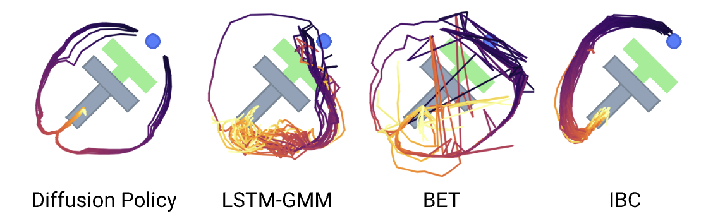

# 扩散策略（Diffusion Policy）

[[项目主页]](https://diffusion-policy.cs.columbia.edu/)
[[论文]](https://diffusion-policy.cs.columbia.edu/#paper)
[[数据]](https://diffusion-policy.cs.columbia.edu/data/)
[[Colab（状态）]](https://colab.research.google.com/drive/1gxdkgRVfM55zihY9TFLja97cSVZOZq2B?usp=sharing)
[[Colab（视觉）]](https://colab.research.google.com/drive/18GIHeOQ5DyjMN8iIRZL2EKZ0745NLIpg?usp=sharing)


[Cheng Chi](http://cheng-chi.github.io/)<sup>1</sup>,
[Siyuan Feng](https://www.cs.cmu.edu/~sfeng/)<sup>2</sup>,
[Yilun Du](https://yilundu.github.io/)<sup>3</sup>,
[Zhenjia Xu](https://www.zhenjiaxu.com/)<sup>1</sup>,
[Eric Cousineau](https://www.eacousineau.com/)<sup>2</sup>,
[Benjamin Burchfiel](http://www.benburchfiel.com/)<sup>2</sup>,
[Shuran Song](https://www.cs.columbia.edu/~shurans/)<sup>1</sup>

<sup>1</sup>哥伦比亚大学,
<sup>2</sup>丰田研究院,
<sup>3</sup>麻省理工学院




## 🛝 试一试！
我们提供的自包含 Google Colab notebook 是体验 Diffusion Policy 最简单的方式。我们分别提供了用于[基于状态的环境](https://colab.research.google.com/drive/1gxdkgRVfM55zihY9TFLja97cSVZOZq2B?usp=sharing)和[基于视觉的环境](https://colab.research.google.com/drive/18GIHeOQ5DyjMN8iIRZL2EKZ0745NLIpg?usp=sharing)的 notebook。

## 🧾 查看我们的实验日志！
对于用于生成[论文](https://diffusion-policy.cs.columbia.edu/#paper)中表 I、II 和 IV 的每个实验，我们提供：
1. 包含复现实验所需全部参数的 `config.yaml`。
2. 每个训练步骤的详细训练/评估 `logs.json.txt`。
3. 每次运行的最佳 `epoch=*-test_mean_score=*.ckpt` 与最后一个 `latest.ckpt` 检查点。

实验日志以如下嵌套目录形式托管在我们的网站上：
`https://diffusion-policy.cs.columbia.edu/data/experiments/<image|low_dim>/<task>/<method>/`

在每个实验目录中你可能会看到：
```
.
├── config.yaml
├── metrics
│   └── logs.json.txt
├── train_0
│   ├── checkpoints
│   │   ├── epoch=0300-test_mean_score=1.000.ckpt
│   │   └── latest.ckpt
│   └── logs.json.txt
├── train_1
│   ├── checkpoints
│   │   ├── epoch=0250-test_mean_score=1.000.ckpt
│   │   └── latest.ckpt
│   └── logs.json.txt
└── train_2
    ├── checkpoints
    │   ├── epoch=0250-test_mean_score=1.000.ckpt
    │   └── latest.ckpt
    └── logs.json.txt
```
`metrics/logs.json.txt` 文件使用 `multirun_metrics.py` 每 50 个 epoch 汇总来自 3 次训练运行的评估指标。论文中的数值对应 `max` 和 `k_min_train_loss` 聚合键。

要下载某个子目录下的所有文件，请使用：

```console
$ wget --recursive --no-parent --no-host-directories --relative --reject="index.html*" https://diffusion-policy.cs.columbia.edu/data/experiments/low_dim/square_ph/diffusion_policy_cnn/
```

## 🛠️ 安装
### 🖥️ 仿真
要复现我们的仿真基准结果，请在配备 Nvidia GPU 的 Linux 机器上安装环境。上游仓库验证过的系统是 Ubuntu 20.04.3。对于 Ubuntu 25.10 这类较新的发行版，`libgl1-mesa-glx` 已经没有可安装候选，应该改装 `libgl1`。
```console
$ sudo apt install -y libosmesa6-dev libgl1 libglfw3 patchelf
$ sudo apt install -y ffmpeg pkg-config libavformat-dev libavcodec-dev libavdevice-dev libavutil-dev libavfilter-dev libswscale-dev libswresample-dev
```

我们推荐使用 [Mambaforge](https://github.com/conda-forge/miniforge#mambaforge) 来替代标准的 Anaconda 发行版，以获得更快的安装速度：
```console
$ mamba env create -f conda_environment.yaml
```

也可以使用 conda：
```console
$ conda env create -f conda_environment.yaml
```

如果你想用 `uv` 管理这个项目的 Python 环境，仓库里已经补了固定版本的依赖清单：
```console
$ uv python install 3.9
$ uv venv --python 3.9 .venv
$ source .venv/bin/activate
$ uv pip install -r requirements/uv-pip-bootstrap.txt
$ python -m pip install --no-build-isolation gym==0.21.0
$ uv pip install --index-strategy unsafe-best-match --build-constraints requirements/uv-build-constraints.txt -r requirements/uv-sim-cu116.txt
$ uv pip install -e .
```

`uv` 使用说明：
* `.python-version` 已固定为 Python 3.9。
* 不要把 `uv pip install --index-url ...` 断成多行，除非每个续行结尾都带 `\`。
* `uv` 默认不会往虚拟环境里装 `pip`，所以后续请继续使用 `uv pip ...`，不要用 `python -m pip ...`。
* `uv` 默认采用严格的 first-index 策略。由于 `torch==1.12.1+cu116` 只在 PyTorch 的 wheel 索引里存在，主安装命令需要显式加上 `--index-strategy unsafe-best-match`。
* `uv` 路径下不再要求安装 `pytorch3d`；旋转表示转换已经改为使用 `scipy`。
* `gym==0.21.0` 在 PyPI 上的元数据本身有问题，所以这里改成先装 `pip` 和旧版 `setuptools`，再单独用 `python -m pip install --no-build-isolation gym==0.21.0`。
* `requirements/uv-build-constraints.txt` 固定了较旧的构建工具版本，用来让 `gym==0.21.0` 这类老包继续成功构建，并把 `Cython` 限制在 `<3` 以兼容 `av==10.0.0`。
* `av==10.0.0` 在部分平台上会走源码构建，因此需要上面那组 FFmpeg 开发包。
* `requirements/uv-real-cu116.txt` 在仿真环境基础上增加了真机相关依赖。
* `robosuite` 被故意从 `requirements/uv-sim-cu116.txt` 中拆出来了，因为它发布出来的依赖元数据会和仓库固定的 `numba==0.56.4` 冲突。如果你确实需要基于 robosuite 的环境，请在主环境装完后再执行 `uv pip install --no-deps -r requirements/uv-robosuite.txt`。
* 这套依赖整体较旧。我们在 Ubuntu 25.10 上实际遇到了 `torch==1.12.1+cu116` 导入失败，报错为 `libtorch_cpu.so: cannot enable executable stack as shared object requires`。如果你遇到同样的问题，最稳妥的办法是切到 Ubuntu 20.04 系环境或容器里训练。

`conda_environment_macos.yaml` 仅用于 MacOS 上的开发，并不完全支持基准测试。

### 🦾 真实机器人
硬件（用于 Push-T）：
* 1x [UR5-CB3](https://www.universal-robots.com/cb3) 或 [UR5e](https://www.universal-robots.com/products/ur5-robot/)（需要 [RTDE 接口](https://www.universal-robots.com/articles/ur/interface-communication/real-time-data-exchange-rtde-guide/)）
* 2x [RealSense D415](https://www.intelrealsense.com/depth-camera-d415/)
* 1x [3Dconnexion SpaceMouse](https://3dconnexion.com/us/product/spacemouse-wireless/)（用于遥操作）
* 1x [Millibar Robotics Manual Tool Changer](https://www.millibar.com/manual-tool-changer/)（只需要机器人端）
* 1x 3D 打印 [末端执行器](https://cad.onshape.com/documents/a818888644a15afa6cc68ee5/w/2885b48b018cda84f425beca/e/3e8771c2124cee024edd2fed?renderMode=0&uiState=63ffcba6631ca919895e64e5)
* 1x 3D 打印 [T-block](https://cad.onshape.com/documents/f1140134e38f6ed6902648d5/w/a78cf81827600e4ff4058d03/e/f35f57fb7589f72e05c76caf?renderMode=0&uiState=63ffcbc9af4a881b344898ee)
* 用于 RealSense 的 USB-C 线缆和螺丝

软件：
* Ubuntu 20.04.3（已测试）
* Mujoco 依赖：
`sudo apt install libosmesa6-dev libgl1 libglfw3 patchelf`
* [RealSense SDK](https://github.com/IntelRealSense/librealsense/blob/master/doc/distribution_linux.md)
* SpaceMouse 依赖：
`sudo apt install libspnav-dev spacenavd; sudo systemctl start spacenavd`
* Conda 环境 `mamba env create -f conda_environment_real.yaml`
* `uv` 环境 `uv pip install -r requirements/uv-pip-bootstrap.txt && python -m pip install --no-build-isolation gym==0.21.0 && uv pip install --index-strategy unsafe-best-match --build-constraints requirements/uv-build-constraints.txt -r requirements/uv-real-cu116.txt && uv pip install -e .`
* 可选 robosuite 扩展 `uv pip install --no-deps -r requirements/uv-robosuite.txt`

## 🖥️ 复现仿真基准结果
### 下载训练数据
在仓库根目录下创建 data 子目录：
```console
[diffusion_policy]$ mkdir data && cd data
```

从 [https://diffusion-policy.cs.columbia.edu/data/training/](https://diffusion-policy.cs.columbia.edu/data/training/) 下载对应的 zip 文件：
```console
[data]$ wget https://diffusion-policy.cs.columbia.edu/data/training/pusht.zip
```

解压训练数据：
```console
[data]$ unzip pusht.zip && rm -f pusht.zip && cd ..
```

获取对应实验的配置文件：
```console
[diffusion_policy]$ wget -O image_pusht_diffusion_policy_cnn.yaml https://diffusion-policy.cs.columbia.edu/data/experiments/image/pusht/diffusion_policy_cnn/config.yaml
```

### 单个随机种子运行
激活 conda 环境并登录 [wandb](https://wandb.ai)（如果尚未登录）。
```console
[diffusion_policy]$ conda activate robodiff
(robodiff)[diffusion_policy]$ wandb login
```

在 GPU 0 上用随机种子 42 启动训练。
```console
(robodiff)[diffusion_policy]$ python train.py --config-dir=. --config-name=image_pusht_diffusion_policy_cnn.yaml training.seed=42 training.device=cuda:0 hydra.run.dir='data/outputs/${now:%Y.%m.%d}/${now:%H.%M.%S}_${name}_${task_name}'
```

CUDA_VISIBLE_DEVICES=0 python train.py \
    --config-name=train_hirol_fr3_unet_abs_jp_ee_state.yaml \
    task=hirol_fr3_3cam_insert_tube \
    dataset_path=data_converter/dataset/1113_left_fr3_insert_pinboard_53ep.zarr \
    training.device=cuda:0 \
    logging.mode=online \
    training.max_ram_gb=13 \
    dataloader.batch_size=6 \
    val_dataloader.batch_size=4

这会创建一个格式为 `data/outputs/yyyy.mm.dd/hh.mm.ss_<method_name>_<task_name>` 的目录，其中保存配置、日志和检查点。策略每 50 个 epoch 进行评估，成功率记录为 wandb 中的 `test/mean_score`，并保存部分轨迹视频。
```console
(robodiff)[diffusion_policy]$ tree data/outputs/2023.03.01/20.02.03_train_diffusion_unet_hybrid_pusht_image -I wandb
data/outputs/2023.03.01/20.02.03_train_diffusion_unet_hybrid_pusht_image
├── checkpoints
│   ├── epoch=0000-test_mean_score=0.134.ckpt
│   └── latest.ckpt
├── .hydra
│   ├── config.yaml
│   ├── hydra.yaml
│   └── overrides.yaml
├── logs.json.txt
├── media
│   ├── 2k5u6wli.mp4
│   ├── 2kvovxms.mp4
│   ├── 2pxd9f6b.mp4
│   ├── 2q5gjt5f.mp4
│   ├── 2sawbf6m.mp4
│   └── 538ubl79.mp4
└── train.log

3 directories, 13 files
```

### 多个随机种子运行
启动本地 ray 集群。对于大规模实验，你可能需要搭建一个支持自动扩缩容的 [AWS 集群](https://docs.ray.io/en/master/cluster/vms/user-guides/launching-clusters/aws.html)。其他命令保持不变。
```console
(robodiff)[diffusion_policy]$ export CUDA_VISIBLE_DEVICES=0,1,2  # 选择由 ray 集群管理的 GPU
(robodiff)[diffusion_policy]$ ray start --head --num-gpus=3
```

启动 ray 客户端，它将启动 3 个训练 worker（3 个随机种子）和 1 个指标监控 worker。
```console
(robodiff)[diffusion_policy]$ python ray_train_multirun.py --config-dir=. --config-name=image_pusht_diffusion_policy_cnn.yaml --seeds=42,43,44 --monitor_key=test/mean_score -- multi_run.run_dir='data/outputs/${now:%Y.%m.%d}/${now:%H.%M.%S}_${name}_${task_name}' multi_run.wandb_name_base='${now:%Y.%m.%d-%H.%M.%S}_${name}_${task_name}'
```

除了每个训练 worker 单独写入的 wandb 日志外，指标监控 worker 还会将来自 3 次训练运行的汇总指标记录到 wandb 项目 `diffusion_policy_metrics`。本地的配置、日志和检查点会写入 `data/outputs/yyyy.mm.dd/hh.mm.ss_<method_name>_<task_name>`，目录结构与我们的[训练日志](https://diffusion-policy.cs.columbia.edu/data/experiments/)一致：
```console
(robodiff)[diffusion_policy]$ tree data/outputs/2023.03.01/22.13.58_train_diffusion_unet_hybrid_pusht_image -I 'wandb|media'
data/outputs/2023.03.01/22.13.58_train_diffusion_unet_hybrid_pusht_image
├── config.yaml
├── metrics
│   ├── logs.json.txt
│   ├── metrics.json
│   └── metrics.log
├── train_0
│   ├── checkpoints
│   │   ├── epoch=0000-test_mean_score=0.174.ckpt
│   │   └── latest.ckpt
│   ├── logs.json.txt
│   └── train.log
├── train_1
│   ├── checkpoints
│   │   ├── epoch=0000-test_mean_score=0.131.ckpt
│   │   └── latest.ckpt
│   ├── logs.json.txt
│   └── train.log
└── train_2
    ├── checkpoints
    │   ├── epoch=0000-test_mean_score=0.105.ckpt
    │   └── latest.ckpt
    ├── logs.json.txt
    └── train.log

7 directories, 16 files
```
### 🆕 评估预训练检查点
从已发布的训练日志文件夹中下载一个检查点，例如 [https://diffusion-policy.cs.columbia.edu/data/experiments/low_dim/pusht/diffusion_policy_cnn/train_0/checkpoints/epoch=0550-test_mean_score=0.969.ckpt](https://diffusion-policy.cs.columbia.edu/data/experiments/low_dim/pusht/diffusion_policy_cnn/train_0/checkpoints/epoch=0550-test_mean_score=0.969.ckpt)。

运行评估脚本：
```console
(robodiff)[diffusion_policy]$ python eval.py --checkpoint data/0550-test_mean_score=0.969.ckpt --output_dir data/pusht_eval_output --device cuda:0
```

这将生成如下目录结构：
```console
(robodiff)[diffusion_policy]$ tree data/pusht_eval_output
data/pusht_eval_output
├── eval_log.json
└── media
    ├── 1fxtno84.mp4
    ├── 224l7jqd.mp4
    ├── 2fo4btlf.mp4
    ├── 2in4cn7a.mp4
    ├── 34b3o2qq.mp4
    └── 3p7jqn32.mp4

1 directory, 7 files
```

`eval_log.json` 包含训练期间记录到 wandb 的指标：
```console
(robodiff)[diffusion_policy]$ cat data/pusht_eval_output/eval_log.json
{
  "test/mean_score": 0.9150393806777066,
  "test/sim_max_reward_4300000": 1.0,
  "test/sim_max_reward_4300001": 0.9872969750774386,
...
  "train/sim_video_1": "data/pusht_eval_output//media/2fo4btlf.mp4"
}
```

## 🦾 真实机器人上的演示、训练与评估
确保你的 UR5 机器人正在运行并通过其网络接口接收指令（随时保持急停按钮在手边），RealSense 相机已连接到工作站（使用 `realsense-viewer` 测试），且 SpaceMouse 已连接并运行 `spacenavd` 守护进程（用 `systemctl status spacenavd` 验证）。

启动演示采集脚本。按 "C" 开始录制。使用 SpaceMouse 控制机器人。按 "S" 停止录制。
```console
(robodiff)[diffusion_policy]$ python demo_real_robot.py -o data/demo_pusht_real --robot_ip 192.168.0.204
```

这会在 `data/demo_pusht_real` 中生成一个演示数据集，其结构与我们的示例[真实 Push-T 训练数据集](https://diffusion-policy.cs.columbia.edu/data/training/pusht_real.zip)相同。

要训练 Diffusion Policy，使用以下配置启动训练：
```console
(robodiff)[diffusion_policy]$ python train.py --config-name=train_diffusion_unet_real_image_workspace task.dataset_path=data/demo_pusht_real
```
如果你的相机设置不同，请编辑 [`diffusion_policy/config/task/real_pusht_image.yaml`](./diffusion_policy/config/task/real_pusht_image.yaml)。

假设训练完成并且你有一个位于 `data/outputs/blah/checkpoints/latest.ckpt` 的检查点，使用下面的命令启动评估脚本：
```console
python eval_real_robot.py -i data/outputs/blah/checkpoints/latest.ckpt -o data/eval_pusht_real --robot_ip 192.168.0.204
```
按 "C" 开始评估（将控制权交给策略）。按 "S" 停止当前 episode。

## 🗺️ 代码库指南
该代码库的结构满足如下需求：
1. 实现 `N` 个任务和 `M` 个方法只需要 `O(N+M)` 的代码量，而不是 `O(N*M)`。
2. 同时保持最大灵活性。

为实现这一需求，我们：
1. 在任务与方法之间维护了一个简单统一的接口。
2. 使任务与方法的实现彼此独立。

这些设计决策的代价是任务与方法之间存在一定的代码重复。我们认为，能够在不影响其他部分的情况下添加/修改任务或方法，并且能够通过线性阅读代码来理解任务/方法，这些收益大于复制粘贴的成本 😊。

### 划分方式
在任务侧，我们有：
* `Dataset`：将（第三方）数据集适配到接口。
* `EnvRunner`：执行一个接受接口的 `Policy`，并生成日志与指标。
* `config/task/<task_name>.yaml`：包含构建 `Dataset` 与 `EnvRunner` 的全部信息。
* （可选）`Env`：一个与 `gym==0.21.0` 兼容的类，封装任务环境。

在策略侧，我们有：
* `Policy`：根据接口实现推理，以及部分训练流程。
* `Workspace`：管理某个方法的训练与评估（交错进行）的生命周期。
* `config/<workspace_name>.yaml`：包含构建 `Policy` 与 `Workspace` 的全部信息。

<a id="the-interface"></a>
### 接口
#### 低维（Low Dim）
一个 [`LowdimPolicy`](./diffusion_policy/policy/base_lowdim_policy.py) 接受观测字典：
- `"obs":` 形状为 `(B,To,Do)` 的 Tensor

并预测动作字典：
- `"action":` 形状为 `(B,Ta,Da)` 的 Tensor

一个 [`LowdimDataset`](./diffusion_policy/dataset/base_dataset.py) 返回一个样本字典：
- `"obs":` 形状为 `(To, Do)` 的 Tensor
- `"action":` 形状为 `(Ta, Da)` 的 Tensor

其 `get_normalizer` 方法返回一个 [`LinearNormalizer`](./diffusion_policy/model/common/normalizer.py)，键为 `"obs","action"`。

`Policy` 使用其 `LinearNormalizer` 的拷贝在 GPU 上处理归一化。`LinearNormalizer` 的参数会作为 `Policy` 权重检查点的一部分保存。

#### 图像（Image）
一个 [`ImagePolicy`](./diffusion_policy/policy/base_image_policy.py) 接受观测字典：
- `"key0":` 形状为 `(B,To,*)` 的 Tensor
- `"key1":` 形状例如 `(B,To,H,W,3)` 的 Tensor（[0,1] float32）

并预测动作字典：
- `"action":` 形状为 `(B,Ta,Da)` 的 Tensor

一个 [`ImageDataset`](./diffusion_policy/dataset/base_dataset.py) 返回一个样本字典：
- `"obs":` 字典：
    - `"key0":` 形状为 `(To, *)` 的 Tensor
    - `"key1":` 形状为 `(To,H,W,3)` 的 Tensor
- `"action":` 形状为 `(Ta, Da)` 的 Tensor

其 `get_normalizer` 方法返回一个 [`LinearNormalizer`](./diffusion_policy/model/common/normalizer.py)，键为 `"key0","key1","action"`。

#### 示例
```
To = 3
Ta = 4
T = 6
|o|o|o|
| | |a|a|a|a|
|o|o|
| |a|a|a|a|a|
| | | | |a|a|
```
论文中的术语：代码库中的 `varname`
- 观测视野（Observation Horizon）：`To|n_obs_steps`
- 动作视野（Action Horizon）：`Ta|n_action_steps`
- 预测视野（Prediction Horizon）：`T|horizon`

经典的（如 MDP）单步观测/动作表述是一个特例，其中 `To=1` 且 `Ta=1`。

## 🔩 关键组件
### `Workspace`
`Workspace` 对象封装了运行实验所需的全部状态与代码。
* 继承自 [`BaseWorkspace`](./diffusion_policy/workspace/base_workspace.py)。
* 由 `hydra` 生成的单个 `OmegaConf` 配置对象应包含构建 Workspace 对象并运行实验所需的全部信息。该配置对应 `config/<workspace_name>.yaml` 加上 hydra 的覆盖项。
* `run` 方法包含实验的完整流程。
* 检查点在 `Workspace` 级别进行。所有作为对象属性实现的训练状态会由 `save_checkpoint` 方法自动保存。
* 其他实验状态应作为 `run` 方法中的局部变量实现。

训练入口是带 `@hydra.main` 装饰器的 `train.py`。请阅读 [hydra](https://hydra.cc/) 的官方文档了解命令行参数与配置覆盖。例如，参数 `task=<task_name>` 会将配置中的 `task` 子树替换为 `config/task/<task_name>.yaml` 的内容，从而为该实验选择任务。

### `Dataset`
`Dataset` 对象：
* 继承自 `torch.utils.data.Dataset`。
* 根据任务是否为 Low Dim 或 Image 观测，返回符合[接口](#the-interface)的样本。
* 提供 `get_normalizer` 方法，返回符合[接口](#the-interface)的 `LinearNormalizer`。

归一化是项目开发中非常常见的 bug 来源。有时打印 `LinearNormalizer` 中每个键使用的 `scale` 和 `bias` 向量会很有帮助。

我们的 `Dataset` 实现大多结合 [`ReplayBuffer`](#replaybuffer) 与 [`SequenceSampler`](./diffusion_policy/common/sampler.py) 来生成样本。根据 `To` 和 `Ta` 正确处理每个演示 episode 开头与结尾的 padding，对性能非常重要。请在实现自己的采样方法前阅读我们的 [`SequenceSampler`](./diffusion_policy/common/sampler.py)。

### `Policy`
`Policy` 对象：
* 继承自 `BaseLowdimPolicy` 或 `BaseImagePolicy`。
* 提供 `predict_action` 方法，给定观测字典并预测符合[接口](#the-interface)的动作。
* 提供 `set_normalizer` 方法，接收 `LinearNormalizer` 并在策略内部处理观测/动作归一化。
* （可选）可能有 `compute_loss` 方法，接收一个 batch 并返回要优化的损失。
* （可选）由于不同方法在训练与评估流程上的差异，通常每个 `Policy` 类对应一个 `Workspace` 类。

### `EnvRunner`
`EnvRunner` 对象抽象了不同任务环境之间的细微差异。
* 提供 `run` 方法，接收一个 `Policy` 对象进行评估，并返回日志与指标字典。每个值都应与 `wandb.log` 兼容。

为了最大化评估速度，我们通常使用对 [`gym.vector.AsyncVectorEnv`](./diffusion_policy/gym_util/async_vector_env.py) 的修改版本进行环境向量化，它在独立进程中运行每个环境（绕过 Python GIL）。

⚠️ 由于子进程在 Linux 上使用 `fork` 启动，对于在初始化期间创建 OpenGL 上下文的环境（例如 robosuite）要特别小心；该上下文一旦被子进程继承，往往会导致像段错误这样的诡异 bug。作为一种变通方案，你可以提供一个 `dummy_env_fn`，在不初始化 OpenGL 的情况下构建环境。

### `ReplayBuffer`
[`ReplayBuffer`](./diffusion_policy/common/replay_buffer.py) 是用于将演示数据集存储在内存与磁盘上的关键数据结构，支持分块与压缩。它大量使用 [`zarr`](https://zarr.readthedocs.io/en/stable/index.html) 格式，同时也提供 `numpy` 后端以降低访问开销。

在磁盘上，它可以以嵌套目录形式（例如 `data/pusht_cchi_v7_replay.zarr`）或 zip 文件形式（例如 `data/robomimic/datasets/square/mh/image_abs.hdf5.zarr.zip`）存储。

由于数据集规模相对较小，通常可以使用 [`Jpeg2000` 压缩](./diffusion_policy/codecs/imagecodecs_numcodecs.py) 将整个图像数据集存入 RAM，从而消除训练期间的磁盘 IO，但会增加 CPU 的工作量。

示例：
```
data/pusht_cchi_v7_replay.zarr
 ├── data
 │   ├── action (25650, 2) float32
 │   ├── img (25650, 96, 96, 3) float32
 │   ├── keypoint (25650, 9, 2) float32
 │   ├── n_contacts (25650, 1) float32
 │   └── state (25650, 5) float32
 └── meta
     └── episode_ends (206,) int64
```

`data` 中的每个数组按第 1 个维度（时间）拼接存储所有 episode 的一个数据字段。`meta/episode_ends` 数组在第 1 个维度上存储每个 episode 的结束索引。

### `SharedMemoryRingBuffer`
[`SharedMemoryRingBuffer`](./diffusion_policy/shared_memory/shared_memory_ring_buffer.py) 是一种无锁 FILO 数据结构，在我们的[真实机器人实现](./diffusion_policy/real_world)中被广泛使用，用于充分利用多核 CPU，同时避免 `multiprocessing.Queue` 的 pickle 序列化与锁开销。

例如，我们希望从 5 个 RealSense 摄像头获取最近的 `To` 帧。我们为每个摄像头启动 1 个 realsense SDK/pipeline 进程，持续将捕获的图像写入与主进程共享的 `SharedMemoryRingBuffer`。由于 `SharedMemoryRingBuffer` 的 FILO 特性，主进程可以非常快速地获取最近的 `To` 帧。

我们还实现了用于 FIFO 的 [`SharedMemoryQueue`](./diffusion_policy/shared_memory/shared_memory_queue.py)，它被用于 [`RTDEInterpolationController`](./diffusion_policy/real_world/rtde_interpolation_controller.py)。

### `RealEnv`
与 [OpenAI Gym](https://gymnasium.farama.org/) 不同，我们的策略与环境进行异步交互。在 [`RealEnv`](./diffusion_policy/real_world/real_env.py) 中，`gym` 的 `step` 方法被拆分为 `get_obs` 和 `exec_actions` 两个方法。

`get_obs` 方法返回来自 `SharedMemoryRingBuffer` 的最新观测以及对应时间戳。该方法可以在评估 episode 的任意时间调用。

`exec_actions` 方法接收一个动作序列及每一步预期执行时间的时间戳。一旦调用，动作会被直接排入 `RTDEInterpolationController` 队列中，方法立即返回而不会阻塞执行。

## 🩹 添加任务
阅读并模仿：
* `diffusion_policy/dataset/pusht_image_dataset.py`
* `diffusion_policy/env_runner/pusht_image_runner.py`
* `diffusion_policy/config/task/pusht_image.yaml`

确保 `shape_meta` 对应你的任务输入与输出的形状。确保 `env_runner._target_` 和 `dataset._target_` 指向你添加的新类。训练时，将 `task=<your_task_name>` 加到 `train.py` 的参数中。

## 🩹 添加方法
阅读并模仿：
* `diffusion_policy/workspace/train_diffusion_unet_image_workspace.py`
* `diffusion_policy/policy/diffusion_unet_image_policy.py`
* `diffusion_policy/config/train_diffusion_unet_image_workspace.yaml`

确保你的 workspace yaml 中的 `_target_` 指向你创建的新 workspace 类。

## 🏷️ 许可证
本仓库基于 MIT 许可证发布。更多详情见 [LICENSE](LICENSE)。

## 🙏 致谢
* 我们的 [`ConditionalUnet1D`](./diffusion_policy/model/diffusion/conditional_unet1d.py) 实现改编自 [Planning with Diffusion](https://github.com/jannerm/diffuser)。
* 我们的 [`TransformerForDiffusion`](./diffusion_policy/model/diffusion/transformer_for_diffusion.py) 实现改编自 [MinGPT](https://github.com/karpathy/minGPT)。
* [BET](./diffusion_policy/model/bet) 基线改编自 [其原始仓库](https://github.com/notmahi/bet)。
* [IBC](./diffusion_policy/policy/ibc_dfo_lowdim_policy.py) 基线改编自 [Kevin Zakka 的复现](https://github.com/kevinzakka/ibc)。
* [Robomimic](https://github.com/ARISE-Initiative/robomimic) 的任务与 [`ObservationEncoder`](https://github.com/ARISE-Initiative/robomimic/blob/master/robomimic/models/obs_nets.py) 在本项目中被广泛使用。
* [Push-T](./diffusion_policy/env/pusht) 任务改编自 [IBC](https://github.com/google-research/ibc)。
* [Block Pushing](./diffusion_policy/env/block_pushing) 任务改编自 [BET](https://github.com/notmahi/bet) 和 [IBC](https://github.com/google-research/ibc)。
* [Kitchen](./diffusion_policy/env/kitchen) 任务改编自 [BET](https://github.com/notmahi/bet) 和 [Relay Policy Learning](https://github.com/google-research/relay-policy-learning)。
* 我们的 [shared_memory](./diffusion_policy/shared_memory) 数据结构深受 [shared-ndarray2](https://gitlab.com/osu-nrsg/shared-ndarray2) 的启发。
