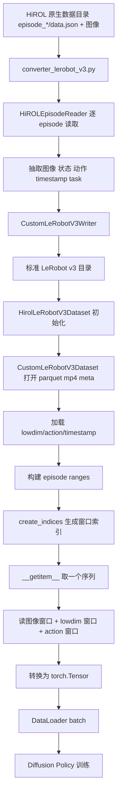
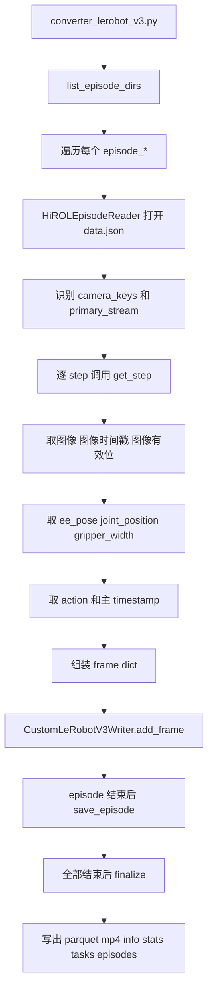
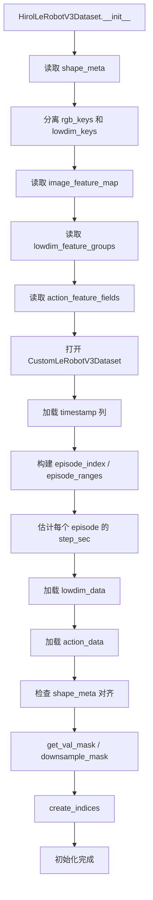
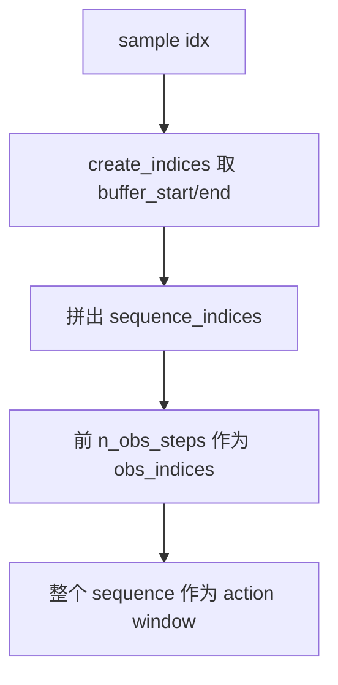
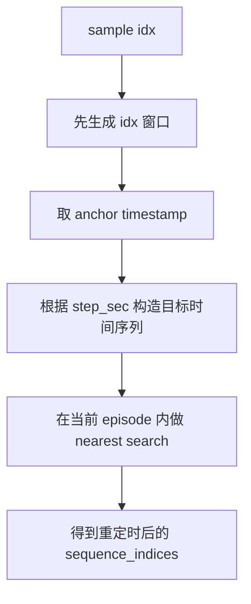
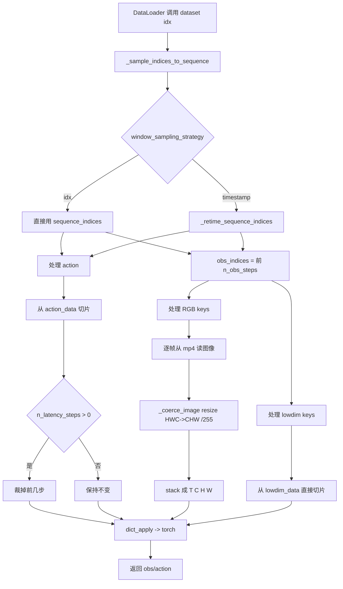
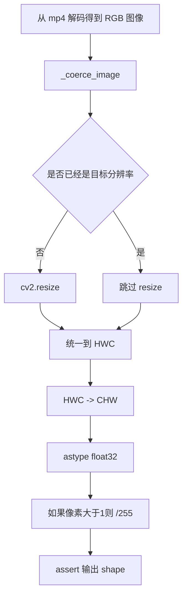
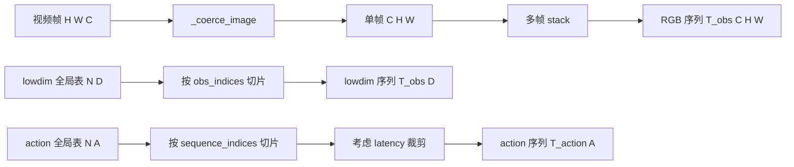
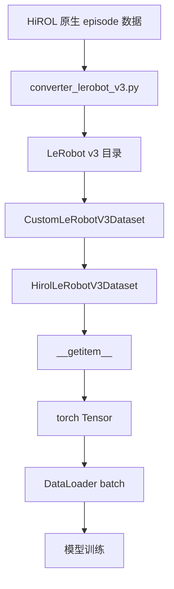

# `hirol_lerobot_v3_dataset.py` 数据流流程图

对应源码：

* [diffusion_policy/dataset/hirol_lerobot_v3_dataset.py](/mnt/code/dp_hirol-main/diffusion_policy/dataset/hirol_lerobot_v3_dataset.py)
* [data_converter/converter_lerobot_v3.py](/mnt/code/dp_hirol-main/data_converter/converter_lerobot_v3.py)
* [diffusion_policy/common/lerobot_v3_io.py](/mnt/code/dp_hirol-main/diffusion_policy/common/lerobot_v3_io.py)

这份文档讲的是**当前训练主线**的数据流：

```text
HiROL 原生数据 -> converter_lerobot_v3.py -> 标准 LeRobot v3 目录
-> HirolLeRobotV3Dataset -> DataLoader -> policy 训练
```

原有 `zarr -> HirolDataset` 训练流没有被删除，但已经不是这份文档的重点。

---

## 1. 总流程图



---

## 2. 当前训练流要点

当前链路不是直接从原生数据训练，而是分成两段：

1. 离线转换  
   把原生 `episode_*/data.json` 和图像文件，整理成标准 LeRobot v3 目录。

2. 训练读取  
   `HirolLeRobotV3Dataset` 读取 LeRobot v3 数据，并继续输出当前 DP 训练需要的：

```python
{
  "obs": {
    "ee_cam_color": ...,
    "third_person_cam_color": ...,
    "side_cam_color": ...,
    "state": ...,
  },
  "action": ...
}
```

也就是说，**存储格式变了，但训练批次契约没变**。

---

## 3. 原生数据到 LeRobot v3 的转换流程



---

## 4. 输出的 LeRobot v3 目录结构

```text
dataset_root/
  data/
    chunk-000/
      file-000.parquet
  meta/
    info.json
    stats.json
    tasks.parquet
    episodes/
      chunk-000/
        file-000.parquet
  videos/
    observation.images.ee_cam_color/
      chunk-000/
        file-000.mp4
    observation.images.third_person_cam_color/
      chunk-000/
        file-000.mp4
    observation.images.side_cam_color/
      chunk-000/
        file-000.mp4
```

其中：

* `data/...parquet`：逐帧低维数据表
* `videos/...mp4`：每路相机的视频
* `meta/info.json`：feature schema、路径模板、fps、robot_type
* `meta/tasks.parquet`：任务表
* `meta/episodes/...parquet`：episode 边界和长度

---

## 5. 写入的关键 feature

当前 converter 写入的训练相关字段主要有：

* `observation.images.ee_cam_color`
* `observation.images.third_person_cam_color`
* `observation.images.side_cam_color`
* `observation.state`
* `observation.state.ee_pose`
* `observation.state.joint_position`
* `observation.state.gripper_width`
* `action`
* `action.joint_position`
* `action.gripper_width`
* `timestamp`
* `episode_index`
* `frame_index`
* `index`
* `task_index`
* `next.done`

另外每路图像还会保存：

* `observation.images.<cam>.timestamp`
* `observation.images.<cam>.is_valid`

---

## 6. 训练侧初始化流程图



这里和旧版 `HirolDataset` 的最大区别是：

* 不再先构建 `ReplayBuffer`
* 直接从 LeRobot v3 的 parquet / mp4 / meta 中取数
* 但窗口采样仍然保留了 DP 风格的 `create_indices` 语义

---

## 7. `idx` 与 `timestamp` 两种窗口策略

训练 config 可以控制：

* `window_sampling_strategy: idx`
* `window_sampling_strategy: timestamp`

它们共享同一个 batch 输出格式，只是窗口构造不同。

### `idx` 模式



含义是：

* 按数组位置采样
* 最接近原 zarr 训练语义
* 默认推荐先用这个模式

### `timestamp` 模式



含义是：

* 仍然在 episode 内采样
* 但窗口会按时间近邻重对齐
* 适合后续实验时对比时序语义

---

## 8. `__getitem__` 取样流程图



---

## 9. 图像处理流程



最终图像张量形状为：

```text
T_obs x C x H x W
```

---

## 10. 训练视角的数据形状变化



默认这条任务里的关键形状是：

* `ee_cam_color`: `T_obs x 3 x 480 x 640`
* `third_person_cam_color`: `T_obs x 3 x 480 x 640`
* `side_cam_color`: `T_obs x 3 x 480 x 640`
* `state`: `T_obs x 15`
* `action`: `T_action x 8`

---

## 11. 最关键的对象关系图



你可以把它理解成：

* 原生数据：采集结果
* converter：离线标准化
* LeRobot v3 目录：训练前的数据资产
* `CustomLeRobotV3Dataset`：底层 reader
* `HirolLeRobotV3Dataset`：面向 DP 的 adapter
* `DataLoader`：批量打包
* 模型训练：真正消费数据

---

## 12. 一眼看懂版总结

如果只记当前主线，可以记这一条：

```text
native hirol -> converter_lerobot_v3.py -> LeRobot v3
-> CustomLeRobotV3Dataset -> HirolLeRobotV3Dataset
-> __getitem__ -> torch.Tensor -> DataLoader -> model
```

和旧版相比，最大的变化是：

```text
旧版: zarr -> ReplayBuffer -> SequenceSampler -> __getitem__
新版: LeRobot v3 -> 直接 reader + adapter -> __getitem__
```

但训练最终拿到的 `obs/action` 契约没有变。

---

## 13. 下一步建议

如果你还想继续顺着数据流看，最适合接着看的文件是：

1. [data_converter/hirol_reader.py](/mnt/code/dp_hirol-main/data_converter/hirol_reader.py)
2. [data_converter/converter_lerobot_v3.py](/mnt/code/dp_hirol-main/data_converter/converter_lerobot_v3.py)
3. [diffusion_policy/common/lerobot_v3_io.py](/mnt/code/dp_hirol-main/diffusion_policy/common/lerobot_v3_io.py)
4. [diffusion_policy/dataset/hirol_lerobot_v3_dataset.py](/mnt/code/dp_hirol-main/diffusion_policy/dataset/hirol_lerobot_v3_dataset.py)
